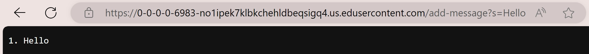
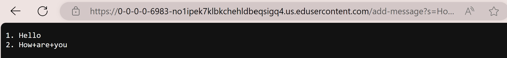

#Part 1
#My code of StringServer:

```
import java.io.IOException;
import java.net.URI;

class Handler implements URLHandler {

    int num = 0;

    public static String s = "";

    public String handleRequest(URI url) {

        if (url.getPath().contains("/add")) {
            String[] parameters = url.getQuery().split("=");
            if (parameters[0].equals("s")) {
                num += 1;
                s += num + ". "  + parameters[1] + "\n";
                return s;
            }
            else{
                return "404 Not Found!";
            }
        }
        return "Please use the '/add-message' to add a single string.";
    }
}

class StringServer {
    public static void main(String[] args) throws IOException {
        if(args.length == 0){
            System.out.println("Missing port number! Try any number between 1024 to 49151");
            return;
        }

        int port = Integer.parseInt(args[0]);

        Server.start(port, new Handler());
    }
}
```
#Add first single string "Hello".


#Add second single string "How are you".



