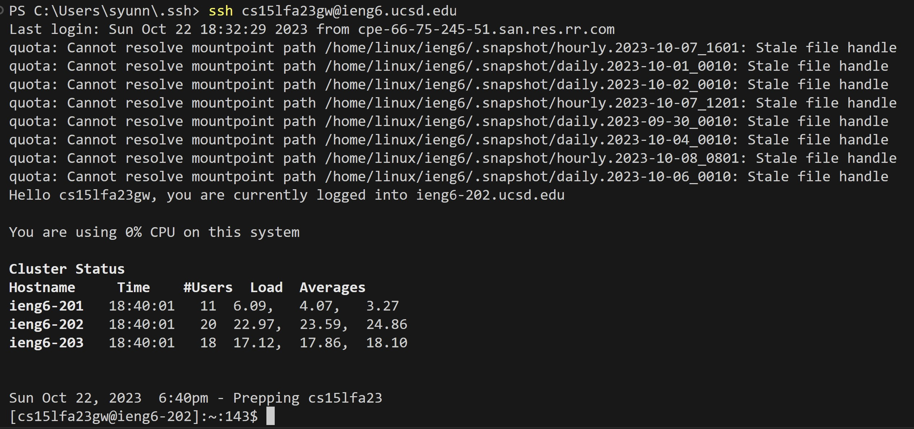

Part 1

My code of StringServer:

```
import java.io.IOException;
import java.net.URI;

class Handler implements URLHandler {

    int num = 0;

    public static String s = "";

    public String handleRequest(URI url) {

        if (url.getPath().contains("/add")) {
            String[] parameters = url.getQuery().split("=");
            if (parameters[0].equals("s")) {
                num += 1;
                s += num + ". "  + parameters[1] + "\n";
                return s;
            }
            else{
                return "404 Not Found!";
            }
        }
        return "Please use the '/add-message' to add a single string.";
    }
}

class StringServer {
    public static void main(String[] args) throws IOException {
        if(args.length == 0){
            System.out.println("Missing port number! Try any number between 1024 to 49151");
            return;
        }

        int port = Integer.parseInt(args[0]);

        Server.start(port, new Handler());
    }
}
```
Add first single string "Hello".

Which methods in your code are called?

The handleRequest method is called.


What are the relevant arguments to those methods, and the values of any relevant fields of the class?

The relevant arguments are the URL and UCI. The UCI includes the path and query. Relevant fields are ```String s``` and ```int num```. ```String s``` is used to add and hold strings from add-messages. ```int num``` is used to show how many single strings we put.


How do the values of any relevant fields of the class change from this specific request? If no values got changed, explain why.

When we add "/add-message?s=Hello". The " /add-message" is the path, the "?s=Hello" is the query. Meanwhile, I use ```String[] parameters = url.getQuery()``` to take the query= parameters[] that I entered and use ```url.getQuery().split("=")``` to separate ? and Hello separately. Thus, ```parameters[0] = s```and ```parameters[1] = Hello```. I set up an if loop so that when ```parameters[0] = "s"``` we make num +1 with ``num+=1``. and ```s += num + ". " + parameters[1] + "\n"``` to add num and parameters[1] to the ```String s``` with a newline. So the output is "1. Hello".


#Add second single string "How are you".

Which methods in your code are called?

The handleRequest method is called.

What are the relevant arguments to those methods, and the values of any relevant fields of the class?

The relevant arguments are the URL and UCI. The UCI includes the path and query. Relevant fields are ```String s``` and ```int num```. ```String s``` is used to add and hold strings from add-messages. ```int num``` is used to show how many single strings we put.

How do the values of any relevant fields of the class change from this specific request? If no values got changed, explain why.

When we add "/add-message?s=How are you". The " /add-message" is the path, the "?s=Hello" is the query. Meanwhile, I use ```String[] parameters = url.getQuery()``` to take the query= parameters[] that I entered and use ```url.getQuery().split("=")``` to separate ? and Hello separately. Thus, ```parameters[0] = s```and ```parameters[1] = Hello```. I set up an if loop so that when ```parameters[0] = "s"``` we make num +1 with ``num+=1``. and ```s += num + ". " + parameters[1] + "\n"``` to add num and parameters[1] to the ```String s``` with a newline. Also, because my computer can't output ```%20``` as a space. Therefore, the output is "2. How+are+you".

Part 2

The path to the private key for your SSH key for logging into ieng6 (on your computer or on the home directory of the lab computer)

The absolute path to the private key is in 
```C:\Users\syunn\.ssh\id_rsa.pub```

The path to the public key for your SSH key for logging into ieng6 (within your account on ieng6)

The absolute path to the public key is in ```/home/linux/ieng6/cs15lfa23/cs15lfa23gw/.ssh/authorized_keys```

A terminal interaction where you log into ieng6 with your course-specific account without being asked for a password.

Copy the local computer's private key to authorized_keys on the school server by ```scp C:\Users\syunn\.ssh\id_rsa.pubcs15lfa23gw@ieng6.ucsd.edu:~/.ssh/authorized_keys```.


Part 3

In a couple of sentences, describe something you learned from lab in week 2 or 3 that you didn’t know before.
I've never touched Linux at all but in, in week2 and week3 I learned how to use cd, ls, pwd and so on. At the same time, I also learned how to remote link, which was something I hadn't touched at all before. I also learned a lot about HTTP URLs and URIs. I think this knowledge will be very major for me to take many CSE classes in the future.
